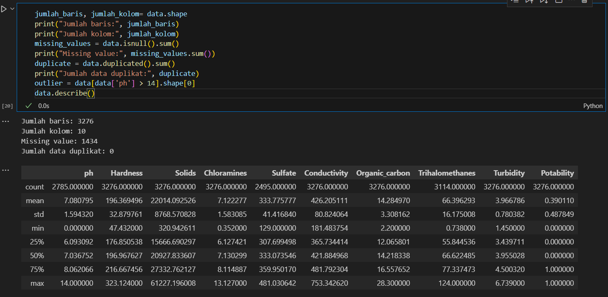
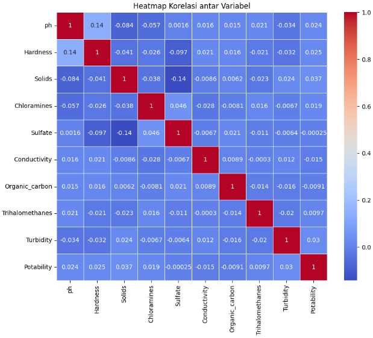
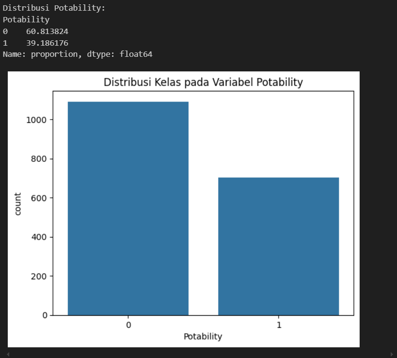
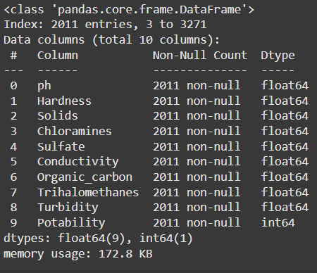
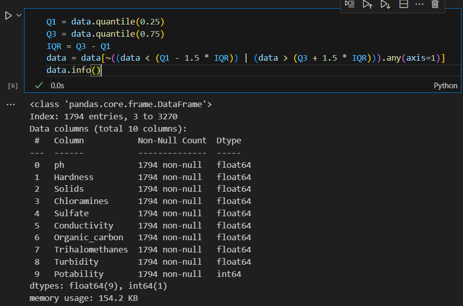
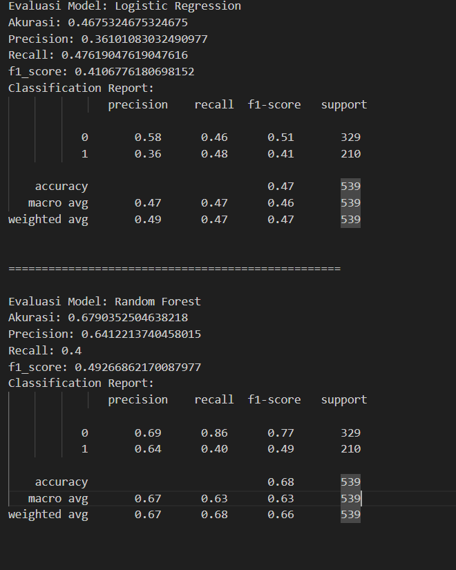

# Laporan Proyek Machine Learning - Zahid Faqih Alim Rabbani

## Klasifikasi Potabilitas Air
### Latar Belakang
Air adalah kebutuhan mendasar bagi kehidupan manusia, tetapi tidak semua air layak untuk diminum. Menurut laporan WHO, sekitar 785 juta orang di dunia kekurangan akses terhadap air minum bersih. Ini dapat menyebabkan masalah kesehatan serius, termasuk penyakit yang ditularkan melalui air seperti diare, kolera, dan tipus. Kondisi air yang tidak layak minum juga berpotensi menurunkan kualitas hidup dan meningkatkan angka kematian, terutama di negara-negara berkembang (WHO, 2019)ntingnya Model Prediksi Kelayakan Air Minum Kualitas air sering kali ditentukan oleh berbagai faktor seperti pH, jumlah kontaminan organik, dan kandungan mineral lainnya. Namun, analisis kualitas air membutuhkan proses laboratorium yang memakan waktu dan biaya. Dengan perkembangan teknologi data, penerapan model machine learning dapat mempercepat proses evaluasi kualitas air dengan memanfaatkan data historis dan indikator kimiawi tertentu. Model ini memberikan cara yang efisien untuk memprediksi kelayakan air secara cepat, terutama di daerah yang memiliki keterbatasan akses terhadap fasilitas pengujian air.

Studi yang dilakukan oleh Journal of Environmental Health menunjukkan bahwa penggunaan model prediksi berbasis data dapat meningkatkan efisiensi pengujian air hingga 40% dibandingkan metode tradisional (Smith et al., 2021) . Selainlitian lain dari National Institutes of Health menyatakan bahwa model berbasis machine learning dapat digunakan untuk memberikan peringatan dini tentang potensi risiko dari air yang terkontaminasi di daerah rawan (NIH, 2020).

**Penyelesaian Masalah**
Membangun model machine learning dapat membantu mengatasi masalah ini dengan memberikan solusi yang cepat dan akurat dalam mendeteksi potabilitas air. Proses ini dimulai dengan mengumpulkan data terkait parameter fisik dan kimia air, melakukan praproses data untuk memastikan kualitas dataset, dan membangun model yang mampu memprediksi apakah sampel air layak diminum atau tidak. Dengan evaluasi akurasi yang tinggi, model ini dapat diterapkan dalam alat pemantauan kualitas air berbasis IoT, sehingga memungkinkan masyarakat dan otoritas kesehatan untuk mengambil keputusan yang tepat terkait kualitas air yang aman.

Pengembangan model prediksi potabilitas air dengan pendekatan machine learning berpotensi besar membantu memitigasi risiko kesehatan terkait air yang tidak layak konsumsi, terutama di daerah yang memiliki keterbatasan akses terhadap uji laboratorium konvensional.

**Referensi**
WHO. (2019). Drinking-water. Retrieved from WHO
Gleick, P. H. (2014). The World’s Water Volume 8: The Biennial Report on Freshwater Resources. Island Press.
Li, X., et al. (2020). Application of Machine Learning for Water Quality Prediction and Early Warning Systems. Environmental Science & Technology, 54(18), 11155–11163.
Al-Omari, A., et al. (2019). Evaluating Machine Learning Algorithms for Water Quality Assessment in Rural Areas. Journal of Environmental Management, 246, 171–178.
Gerba, C.P., & Pepper, I.L. (2019). Environmental Microbiology: Water and Wastewater Microbiology. Academic Press.

## Business Understanding

### Problem Statements

- Bagaimana cara membangun model machine learning yang efektif dalam memprediksi potabilitas air dengan memanfaatkan parameter fisik dan kimia (seperti pH, hardness, solids, dll) yang ada dalam dataset?
- Bagaimana teknik optimasi, seperti pemilihan algoritma dapat meningkatkan akurasi model dalam menentukan potabilitas air?

### Goals
- Mengembangkan dan melatih model machine learning menggunakan data potabilitas air untuk memprediksi kelayakan konsumsi air berdasarkan parameter kualitasnya, dengan target akurasi dan F1-score yang tinggi.
- Mengidentifikasi algoritma machine learning yang paling optimal untuk menentukan potabilitas air melalui perbandingan performa beberapa model

### Solutions Statements
Menggunakan 2 algoritma machine learning seperti logistic regression dan randomforest classifier serta membandingkannya pada evaluasi untuk menentukan algoritma yang paling optimal pada klasifikasi potabilitas air

Mengumpulkan data yang relevan terkait kualitas air yang mencakup parameter fisik dan kimiawi (seperti pH, hardness, solids, dll) dari sumber yang terpercaya. Setelah data terkumpul, melakukan pra-pemrosesan untuk membersihkan data dari nilai yang hilang, mendeteksi dan menangani outlier, serta melakukan normalisasi atau standarisasi untuk memastikan data siap digunakan dalam pelatihan model.
## Data Understanding
Dataset yang saya gunakan diambil dari kaggle. Berikut adalah sumber datasetnya: 
https://www.kaggle.com/datasets/adityakadiwal/water-potability

### Kondisi Data

Pada gambar diatas diketahui bahwa jumlah data sebanyak 3276 baris dan 10 kolom, missing value sebanyak 1434, dan tidak ada data duplikat.

Sementara untuk outliers dapat dideteksi dengan boxplot
for column in data.columns:
    plt.figure(figsize=(6, 4))
    sns.boxplot(x=data[column])
    plt.title(f'Boxplot untuk {column}')
    plt.show()

dari boxplot terindikasi bahwa dataset terdapat outliers pada masing-masing fitur kecuali potability

**Melihat korelasi antar variabel dengan heatmap**
plt.figure(figsize=(10, 8))
sns.heatmap(data.corr(), annot=True, cmap='coolwarm', linewidths=0.5)
plt.title('Heatmap Korelasi antar Variabel')
plt.show()

dari heatmap tersebut didapatkan bahwa hubungan antar variabel dengan potabiity sangat lemah.

**Melihat apakah distribusi target yaitu potability value seimbang atau tidak dengan grafik**
print("Distribusi Potability:")
print(data['Potability'].value_counts(normalize=True) * 100)

sns.countplot(x='Potability', data=data)
plt.title("Distribusi Kelas pada Variabel Potability")
plt.show()

dari plot grafik diatas didapat bahwa distribusi kelas pada variabel potability kurang seimbang, untuk mengatasinya, saya memakai class_weight='balanced' pada saat modelling.

### Variabel-variabel pada water-potability dataset adalah sebagai berikut:
- ph : merupakan tingkat keasaman pada air, diukur dengan skala pH (0-14). pH di bawah 7 menunjukkan sifat asam, sedangkan pH di atas 7 menunjukkan sifat basa.
- hardness :  hardness mengacu pada jumlah mineral (terutama kalsium dan magnesium) yang terlarut di dalam air.
- solids : Mengukur jumlah total padatan terlarut (TDS) di dalam air, dalam satuan mg/L.
- chloramines : Konsentrasi kloramin dalam air, yang merupakan kombinasi dari klorin dan amonia, biasanya digunakan untuk desinfeksi.
- Sulfate : Konsentrasi ion sulfat (SO4) dalam air, biasanya dihasilkan dari pelarutan mineral alam.
- Conductivity : Kemampuan air untuk menghantarkan listrik, yang dipengaruhi oleh ion-ion terlarut seperti garam, logam, dan mineral lainnya.
- Organic__carbon : Kandungan karbon organik dalam air, yang diukur dalam satuan mg/L.
- trihalomethanes : Konsentrasi senyawa trihalometana dalam air, yang merupakan hasil sampingan dari proses desinfeksi menggunakan klorin.
- Turbidity : Mengukur tingkat kekeruhan air yang disebabkan oleh partikel tersuspensi, diukur dalam satuan NTU (Nephelometric Turbidity Units).
- Potability :  Variabel target yang menunjukkan apakah air layak diminum (1) atau tidak layak minum (0).

## Data Preparation

- Pertama-tama adalah membuang data yang tidak bernilai dan data yang duplikat
data = data.dropna()
data = data.drop_duplicates()
data.info()

- Selanjutnya untuk mengatasi outliers, maka kita perlu **menghapus outliers dengan metode IQR.**
Caranya adalah menghitung kuartil pertama (Q1) dan kuartil ke3 (Q3) dengan fungsi quantile(). IQR (Interquartile Range) dihitung sebagai selisih antara Q3 dan Q1, digunakan untuk menentukan batasan dalam mendeteksi outlier. Outliers yang diidentifikasi oleh boxplot (disebut juga "boxplot outliers") didefinisikan sebagai data yang nilainya 1.5 QR di atas Q3 atau 1.5 QR di bawah Q1. 

- Selanjutnya memisahkan fitur dan targetnya yaitu potability sesuai tujuan kita
x=data.drop('Potability',axis=1)
y=data['Potability']
- Langkah selanjutnya adalah **scaling data dengan standarscaler** untuk menstandarkan atau menormalisasi fitur dalam dataset agar memiliki skala yang seragam. Dalam dataset ini, fitur-fitur memiliki rentang yang berbeda . Ini bisa membuat model lebih fokus pada fitur dengan skala yang lebih besar, sehingga mengganggu hasil model.
scaler = StandardScaler()
X_scaled = scaler.fit_transform(X)
- Langkah terakhir pada data preparation adalah **Split data dengan train test split** Tujuannya adalah untuk menguji dan memvalidasi kinerja model secara objektif, agar model tidak hanya baik pada data pelatihan tetapi juga dapat bekerja dengan baik pada data yang tidak pernah dilihat sebelumnya.
x_train,x_test,y_train,y_test=train_test_split(x,y,test_size=0.2,random_state=42)

## Modeling
Model machine learning yang saya gunakan adalah logistic regression dan randomforest, dan akan memilih yang terbaik dari 2 algoritma tersebut.

**Cara kerja algoritma logistic regression**
Logistic Regression menggunakan model linear untuk menggabungkan fitur input (X) dengan parameter (β) untuk menghasilkan skor (logit).
Untuk mengubah nilai skor menjadi probabilitas, Logistic Regression menggunakan fungsi sigmoid dan hasil dari fungsi sigmoid adalah nilai antara 0 dan 1, yang mengindikasikan probabilitas dari kelas target. Selanjutnya Logistic Regression mengklasifikasikan data ke dalam dua kelas dengan menentukan threshold, biasanya 0.5. Jika probabilitas lebih besar dari 0.5, maka prediksi adalah kelas 1, jika tidak maka kelas 0.

**parameter yang digunakan pada algoritma logistic regression**
random_state: Menetapkan nilai acak untuk reprodusibilitas hasil eksperimen.
Dengan menetapkan random_state ke suatu nilai tetap (pada kasus ini random_state=42), kita bisa memastikan bahwa hasil yang diperoleh akan selalu sama setiap kali model dijalankan dengan kondisi yang sama.

class_weight='balanced' : digunakan untuk menangani masalah class imbalance, yaitu kondisi ketika jumlah sampel dalam setiap kelas sangat berbeda. Ketidakseimbangan kelas bisa mengakibatkan model lebih condong (bias) ke kelas mayoritas, karena jumlah sampel yang lebih dominan. Saat kita menetapkan class_weight='balanced', model akan memberikan bobot yang lebih besar pada kelas minoritas, sehingga kesalahan pada kelas ini menjadi lebih mahal dalam fungsi loss.

**Kelebihan algoritma logistic regression**
- Logistic Regression sangat cepat untuk dilatih pada dataset ukuran kecil hingga menengah, menjadikannya pilihan yang baik untuk baseline model dan ketika sumber daya komputasi terbatas.
- Model ini efektif untuk dataset yang memiliki hubungan linear antara fitur dan target.

**kekurangan algoritma logistic regression**
- Logistic Regression tidak dapat menangkap pola non-linear dalam data.
- Logistic Regression cenderung sensitif terhadap nilai ekstrem atau outliers, yang dapat menyebabkan model memiliki akurasi rendah jika data tidak dibersihkan.
-  Pada dataset yang memiliki banyak fitur dengan interaksi yang kompleks, Logistic regression kalah dengan model seperti randomforest

**Cara kerja algoritma randomforest**
Random Forest adalah algoritma ensemble yang menggunakan banyak Decision Trees untuk membuat prediksi yang lebih stabil dan akurat. Algoritma ini bekerja dengan membuat beberapa Decision Trees dari subset data yang berbeda, kemudian menggabungkan prediksi dari setiap pohon untuk mendapatkan hasil akhir.

Pertama-tama Dataset dibagi menjadi beberapa subset dengan cara sampling acak dengan penggantian (bootstrap sampling). Setiap subset digunakan untuk membangun satu Decision Tree.
Untuk setiap pohon, subset fitur yang berbeda dipilih secara acak saat menentukan setiap split. Ini membantu mengurangi korelasi antar pohon. Setiap pohon dilatih pada subset data dan membuat prediksi independen.
Untuk klasifikasi, prediksi akhir ditentukan dengan melakukan voting majority dari semua Decision Trees.

**Parameter yang digunakan pada algoritma randomforest**
random_state: Menetapkan nilai acak untuk reprodusibilitas hasil eksperimen.
Dengan menetapkan random_state ke suatu nilai tetap (pada kasus ini random_state=42), kita bisa memastikan bahwa hasil yang diperoleh akan selalu sama setiap kali model dijalankan dengan kondisi yang sama.

class_weight='balanced' : digunakan untuk menangani masalah class imbalance, yaitu kondisi ketika jumlah sampel dalam setiap kelas sangat berbeda. Ketidakseimbangan kelas bisa mengakibatkan model lebih condong (bias) ke kelas mayoritas, karena jumlah sampel yang lebih dominan. Saat kita menetapkan class_weight='balanced', model akan memberikan bobot yang lebih besar pada kelas minoritas, sehingga kesalahan pada kelas ini menjadi lebih mahal dalam fungsi loss.

**Kelebihan algoritma randomforest**
- Mampu menangani Hubungan non-linear
- Lebih robust terhadap overfitting
- Tahan terhadap outliers dan Data Hilang

**Kekurangan algoritma randomforest**
- Waktu yang lebih lambat dan Sumber daya Komputasi yang tinggi
- Mudah overfit pada dataset yang sedikit

Dikarenakan dataset yang cukup besar dan hubungannya non-linear maka disini algoritma randomforest lebih diuntungkan.

## Evaluation

Metrik evaluasi yang digunakan adalah **accuracy, precision score, recall, dan F1 Score**. Berikut adalah penjelasan masing-masing metrik:

- **Accuracy**
Pada model dengan algoritma logistic regression didapatkan akurasi 0.47 sedangkan pada algoritma randomforest didapatkan akurasi 0.68, hal ini disebabkan dataset merupakan non-linear yang dimana algoritma randomforest bekerja lebih baik. 
- **Precision**
Pada algoritma logistic regression didapatkan precision 0.36. Artinya, dari semua prediksi positif (layak minum) yang dibuat oleh Logistic Regression, 36% prediksi benar-benar layak minum. 
Sedangkan pada algoritma randomforest didapatkan precision hanya sebanyak 0.64, maka 64% dari prediksi layak minum memang benar-benar layak. 
- **Recall (sensitivitas)**
pada algoritma logistic regression recall model berada di angka 0.48, yang berarti dari seluruh data air yang layak minum, model hanya mampu mendeteksi 48% dengan benar. Sedangka pada algoritma randomforest recall model berada di angka 0.40, yang berarti dari seluruh data air yang layak minum, model hanya mampu mendeteksi 40% dengan benar.
- **F1 Score**
Pada algoritma logistic regression F1 Score model didapatkan 0.41, ini menunjukkan bahwa model ini memiliki keseimbangan moderat antara precision dan recall. F1 score yang lebih rendah pada Logistic Regression mengindikasikan bahwa model ini mungkin kurang optimal untuk menangani trade-off antara kesalahan positif dan kesalahan negatif dalam prediksi potabilitas air.
Sedangkan pada algoritma randomforest F1 Score didapatkan 0.49, ini menunjukkan bahwa model ini mencapai keseimbangan yang lebih baik antara precision dan recall. Skor F1 membuat model ini lebih handal dalam kasus di mana baik kesalahan positif maupun negatif harus diminimalkan.

dari evaluasi diatas, dapat disimpulkan bahwa algoritma random forest classifier umumnya menunjukkan performa yang lebih tinggi daripada Logistic Regression dalam hal accuracy, precision, recall, dan F1 score. Ini mengindikasikan bahwa Random Forest lebih baik dalam menangkap pola non-linear dan interaksi antar fitur pada dataset potabilitas air.

untuk memaksimalkan keamanan dan memastikan bahwa air yang dianggap layak memang aman dikonsumsi, Random Forest tampaknya menjadi model yang lebih andal karena mampu mengurangi kesalahan prediksi dan mencapai keseimbangan yang lebih baik antara presisi dan sensitivitas.

akurasi pada model yang tidak tinggi mungkin disebabkan oleh dataset yang korelasi antar variabel lemah dan kurang seimbangnya distribusi variabel potabilitasnya.